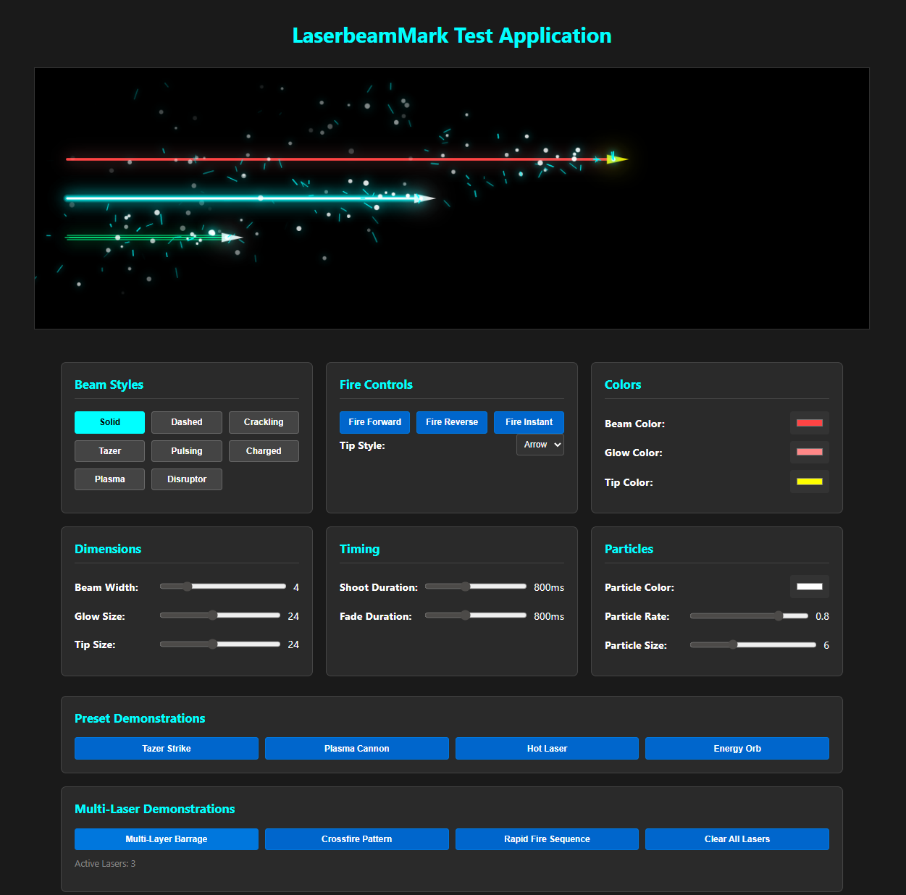

# LaserbeamMark

A powerful JavaScript class for creating stunning laser beam effects with multiple visual styles, particle systems, and smooth animations. Perfect for games, interactive applications, and visual effects.



## Features

✨ **8 Distinct Beam Styles**: Solid, Dashed, Crackling, Tazer, Pulsing, Charged, Plasma, and Disruptor  
🎨 **Customizable Colors**: Independent beam, glow, and tip colors  
⚡ **Dynamic Firing Modes**: Forward, reverse, and instant firing directions  
🔥 **Particle Effects**: Configurable particle systems with sparks and trails  
🎯 **Tip Styles**: Arrow and circle tip options  
📏 **Flexible Dimensions**: Adjustable beam width, glow size, and tip size  
⏱️ **Timing Controls**: Configurable shoot and fade durations  
🖱️ **Interactive Demo**: Complete web-based test application

## Quick Start

### Installation

Simply include the `laserbeammark.js` file in your project:

```javascript
import { LaserbeamMark } from "./laserbeammark.js";
```

### Basic Usage

```javascript
// Create a laser beam
const laser = new LaserbeamMark(canvas, {
  beamStyle: "tazer",
  coords1: [50, 100],
  coords2: [400, 100],
  beamColor: "#00ffff",
  glowColor: "#00ffff",
});

// In your game loop
laser.update(deltaTime);
laser.render();

// Fire the laser
laser.fire(1); // Forward direction
```

## Interactive Demo

The repository includes a comprehensive interactive demo application (`index.html`) that showcases all LaserbeamMark features:

**To run the demo:**

1. Start an HTTP server: `python3 -m http.server 8000`
2. Open `http://localhost:8000` in your browser
3. Experiment with different beam styles, colors, and effects in real-time

The demo features:

- **Beam Style Selection**: Test all 8 beam effects
- **Real-time Controls**: Adjust colors, dimensions, timing, and particles
- **Fire Controls**: Test different firing modes and tip styles
- **Preset Demonstrations**: Quick-access buttons for common configurations

## Documentation

For detailed developer documentation, API reference, and advanced usage examples, see:

📖 **[LaserbeamMark Documentation](laserbeammark.md)**

The documentation covers:

- Complete API reference
- All beam styles with descriptions
- Configuration options
- Integration examples
- Performance tips

## Files

- `laserbeammark.js` - Main LaserbeamMark class
- `laserbeammark.md` - Detailed developer documentation
- `index.html` - Interactive demo application
- `README.md` - This overview

## Browser Compatibility

LaserbeamMark uses ES6 modules and requires a modern browser with Canvas 2D support. The demo must be served through an HTTP server due to ES6 module security requirements.

## License

This project is licensed under the MIT License - see the [LICENSE](LICENSE) file for details.
